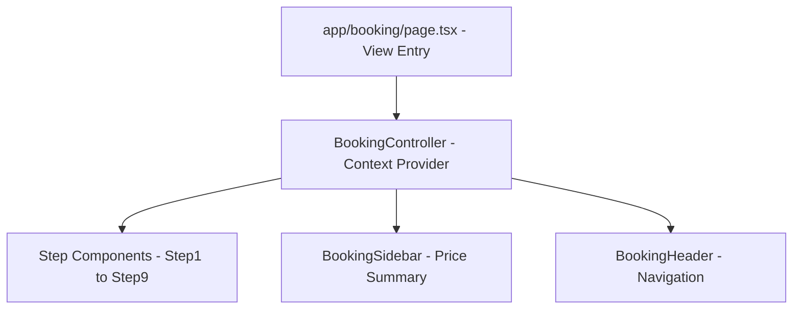

# Elite Screens - Premium Private Theatre Booking Platform

Elite Screens is a high-fidelity, premium private theatre experience booking web application tailored for Delhi NCR (located in Sector 4, Noida). The application allows users to book private luxury cinema rooms for special celebrations—such as anniversaries, birthdays, proposals, and movie screenings—customizing their slots with decorations, cakes, gifts, and payment methods.

---

## 🛠️ Tech Stack & Frameworks

The project is built on a modern, performance-oriented stack:

- **Core Framework**: [Next.js 16.2.9 (App Router)](https://nextjs.org/) using React 19.
- **Development Tooling**: Next.js Turbopack for compilation and hot-reloading.
- **Styling Engine**: [Tailwind CSS v4](https://tailwindcss.com/) with PostCSS, leveraging CSS Color Module Level 4 spaces (such as `oklch` and `lab`) for vibrant color systems.
- **Language**: TypeScript (v5) for type safety.
- **Iconography**: [Lucide React](https://lucide.dev/) for crisp, scalable vector icons.
- **PDF Generation Engine**: 
  - [jsPDF (v4.2.1)](https://github.com/parallax/jsPDF) for client-side PDF document layout.
  - [html2canvas-pro (v2.0.4)](https://github.com/yorickshan/html2canvas-pro) to capture and render high-fidelity DOM elements, supporting modern CSS properties without crashing.
- **Linter**: ESLint (v9) utilizing Flat Configuration.

---

## ✨ Features

### 🌟 Luxury Brand Aesthetics
- **Premium Themes**: Dark/Gold/Light contrast color system representing premium luxury experiences.
- **Interactive Shimmer Elements**: Smooth gold glow sweeps and rotate transitions on hover for brand logos and action frames.
- **Scrolling Announcement Bar**: Top announcement tape with high-visibility marquee alerts and active contact phone support numbers.

### 🗓️ 9-Step Interactive Booking Engine
Managed by a unified controller, the checkout sequence guides clients through:
1. **Location & Date Picker**: Defaulted to Noida Sector 4 with live calendar inputs.
2. **Theater & Slot Selector**: Compares rooms (Theatre 1, Theatre 2, Theatre 3) with dynamic specifications, capacities, base rates, and interactive time blocks.
3. **Occasion Customizer**: Configures settings for Birthdays, Anniversaries, Proposals, or Romantic Dates (including name matching for couples).
4. **Guests Capacity Counter**: Dynamically adds additional charges based on theater capacity rules.
5. **Cakes Selection**: Categorized menu (Eggless, Custom, Premium) allowing quantity selection.
6. **Balloon decorations & Custom Message**: Setup balloon types and define custom text to write on the decor.
7. **Gifts & Greeting Cards**: Add-ons like flower bouquets, chocolate boxes, and personalized greeting cards.
8. **Billing Details & Payment Form**: Summarizes price additions, collects client contact info, and features interactive mock checkout panels for Credit Cards and UPI (complete with QR code scans).
9. **Instant PDF Receipt Downloads**: Client receipt generation, detailing paid advances, remaining theatre balances, and checklists (Aadhaar cards, directions).

### 📍 Contact Maps & Tooltips
- Centralized location inputs pointing to the Sector 4, Noida branch.
- Floating location badge displaying the full showroom address overlaid on Google Maps.

---

## 🏗️ Project Architecture (MVC Style)

The project separates logic, data structures, and views to ensure maximum code readability and component isolation:



### 1. Controller Layer (`src/controllers/`)
- [BookingController.tsx](file:///C:/Users/dell/.gemini/antigravity/scratch/dazzling-screens-clone/src/controllers/BookingController.tsx): Centralized Context Provider managing the entire booking state machine. Includes:
  - Form validation rules.
  - Interactive timer countdowns (reserves slots for 10 minutes).
  - Centralized price calculation math (Grand Total, Advance, and Balances).
  - URL parameter synchronization (pushes state to the URL search parameters to preserve history and allow browser back/forward navigation).

### 2. Views Layer (`src/views/booking/`)
Separated into individual steps to ensure files remain under **150-200 lines** of code:
- [Step1LocationDate.tsx](file:///C:/Users/dell/.gemini/antigravity/scratch/dazzling-screens-clone/src/views/booking/Step1LocationDate.tsx) (Location & Date selection)
- [Step2TheatreSlots.tsx](file:///C:/Users/dell/.gemini/antigravity/scratch/dazzling-screens-clone/src/views/booking/Step2TheatreSlots.tsx) (Dynamic slot comparisons)
- [Step3Occasion.tsx](file:///C:/Users/dell/.gemini/antigravity/scratch/dazzling-screens-clone/src/views/booking/Step3Occasion.tsx) (Celebration details & couple names)
- [Step4Guests.tsx](file:///C:/Users/dell/.gemini/antigravity/scratch/dazzling-screens-clone/src/views/booking/Step4Guests.tsx) (Capacities and counters)
- [Step5Cakes.tsx](file:///C:/Users/dell/.gemini/antigravity/scratch/dazzling-screens-clone/src/views/booking/Step5Cakes.tsx) (Cakes selection drawer)
- [Step6Decorations.tsx](file:///C:/Users/dell/.gemini/antigravity/scratch/dazzling-screens-clone/src/views/booking/Step6Decorations.tsx) (Balloon themes list)
- [Step7Gifts.tsx](file:///C:/Users/dell/.gemini/antigravity/scratch/dazzling-screens-clone/src/views/booking/Step7Gifts.tsx) (Greeting cards & chocolates)
- [Step8BookingDetails.tsx](file:///C:/Users/dell/.gemini/antigravity/scratch/dazzling-screens-clone/src/views/booking/Step8BookingDetails.tsx) (Checkout fields and mock gateway panels)
- [Step9Success.tsx](file:///C:/Users/dell/.gemini/antigravity/scratch/dazzling-screens-clone/src/views/booking/Step9Success.tsx) (Booking verification summary & PDF rendering)

### 3. Component Layer (`src/components/`)
Modular subcomponents broken down by page route:
- `components/home/`: Houses sections for Hero, Service Categories, Theatre Previews, FAQ, Reviews, and Lightboxes.
- `components/about/`: Story, counting animations, and founder note blocks.
- `components/gallery/`: Image tab filters and lightbox popups.
- `components/contact/`: Details cards, feedback forms, and map embeddings.
- `components/waitlist/`: Early registration components.

---

## 🔧 Operations & Refactoring Completed

1. **Rebranding**: Changed the name to "Elite Screens" across all logos, pages, metadata, policies, and navigation tabs.
2. **Support Number Centralization**: Updated all links, WhatsApp nodes, and support lines to call `9853247324`.
3. **Location Defaults**: Hardcoded default start coordinates and values to select Noida Sector 4 immediately.
4. **Code Modularization**: Refactored large page routers. Checked file length constraints (< 200 lines) and naming clarity for all split sections.
5. **Modern CSS Crash Fix**: 
   - *Problem*: Standard `html2canvas` failed to parse computed styles containing Tailwind v4's `lab()` colors, throwing a blank error stack in the browser.
   - *Solution*: Replaced standard imports with `html2canvas-pro` (a version optimized to parse Color Level 4 syntax), deleted compiler cache directories, and tested successfully.

---

## 🚀 Getting Started

### Installation
Clone the repository and install dependencies:
```bash
npm install
```

### Running Locally
To launch the hot-reloading development server:
```bash
npm run dev
```
Open [http://localhost:3000](http://localhost:3000) in your browser.

### Type-Checking & Linting
Run static analysis checks:
```bash
# Verify TypeScript type correctness
npx tsc --noEmit

# Run ESLint validation
npm run lint
```

### Build for Production
To compile a fully optimized production bundle:
```bash
npm run build
```
